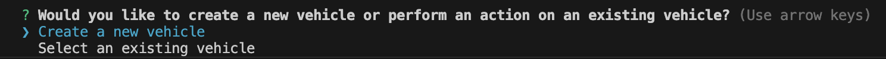
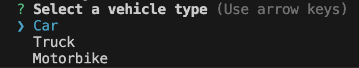
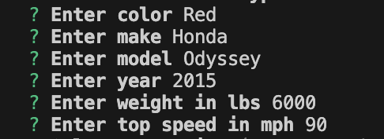
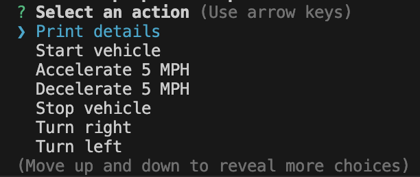
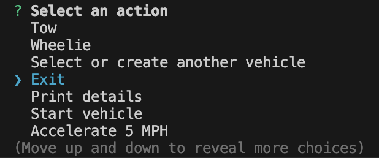

# Vehicle Builder Application

## Description

This application allows users to select and create vehicles and then perform certain actions on those vehicles, like accelerate, decelerate, or tow (if able). The user will start the application using npm start and exit the application using the 'Exit' option. This project was built as part of the Module 8 Challenge for the Rutgers University Coding Bootcamp. My motivation in completing this project was to not only improve my ability to code in TypeScript but also to improve the quality of my code by addressing my problem areas. For example, even though validation was not a requirement for this project, I implemented it because it was something I skipped over last time, and I want to write better code. While this project helped me learn more about Inquirer and TypeScript, it also gave me some real world experience by using starter code instead of starting from scratch.

## Table of Contents (Optional)

- [Installation](#installation)
- [Usage](#usage)
- [Credits](#credits)
- [License](#license)
- [Questions](#questions)
- [Video](#video)

## Installation

1. In the terminal, navigate to where you would like the repo to be stored on your device.

2. Using the HTTPS or SSH key found in the GitHub repo, clone the repo to your device using the following:

    ```sh
    git clone <filepath>
    ```

3. Open the newly installed vehicle-builder directory in the terminal. In the command line, install dependencies using the following:

    ```sh
    npm i
    ```

## Usage

1. Open the command line and navigate to the vehicle-builder directory if you are not already there. Use npm start to start the application:

    ```sh
    npm start
    ```

2. You should be prompted to create a vehicle or select an existing vehicle. Use the arrows to scroll between the two, and hit enter to select an option.

    

3. If you hit 'Create a new vehicle', you will be prompted to select 'Car', 'Truck', or 'Motorbike'. Select one.

    

4. When you select one of these options, you will be prompted to enter information about the vehicle. Prompts may differ depending on the type of vehicle selected.

    

5. You will then be able to perform actions on the vehicle. Note that you must start the vehicle to perform some actions, like accelerate and decelerate. Additionally, some vehicle types will not be able to perform certain actions, like wheelie or tow.

    

6. When you are ready to exit the application, select the 'Exit' option from the vehicle actions list.

    

## Credits

Starter code was sourced from Rutgers University Coding Bootcamp section RUT-VIRT-FSF-PT-10-2024-U-LOLC-MWTH > Assignments > Module 8 Challenge > starter code (https://bootcampspot.instructure.com/courses/6369/assignments/90394?module_item_id=1341044). All other contributions were made by myself. 

GitHub: amelia1105 (https://github.com/amelia1105)

## License

MIT License

Copyright (c) 2024 Amelia Bellanger

Permission is hereby granted, free of charge, to any person obtaining a copy
of this software and associated documentation files (the "Software"), to deal
in the Software without restriction, including without limitation the rights
to use, copy, modify, merge, publish, distribute, sublicense, and/or sell
copies of the Software, and to permit persons to whom the Software is
furnished to do so, subject to the following conditions:

The above copyright notice and this permission notice shall be included in all
copies or substantial portions of the Software.

THE SOFTWARE IS PROVIDED "AS IS", WITHOUT WARRANTY OF ANY KIND, EXPRESS OR
IMPLIED, INCLUDING BUT NOT LIMITED TO THE WARRANTIES OF MERCHANTABILITY,
FITNESS FOR A PARTICULAR PURPOSE AND NONINFRINGEMENT. IN NO EVENT SHALL THE
AUTHORS OR COPYRIGHT HOLDERS BE LIABLE FOR ANY CLAIM, DAMAGES OR OTHER
LIABILITY, WHETHER IN AN ACTION OF CONTRACT, TORT OR OTHERWISE, ARISING FROM,
OUT OF OR IN CONNECTION WITH THE SOFTWARE OR THE USE OR OTHER DEALINGS IN THE
SOFTWARE.

## Questions

For any questions about this project, please contact me by email: aebellanger@yahoo.com

## Video
[How to install and use this application]()